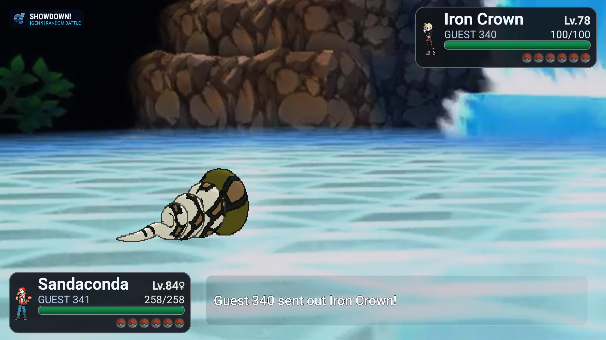
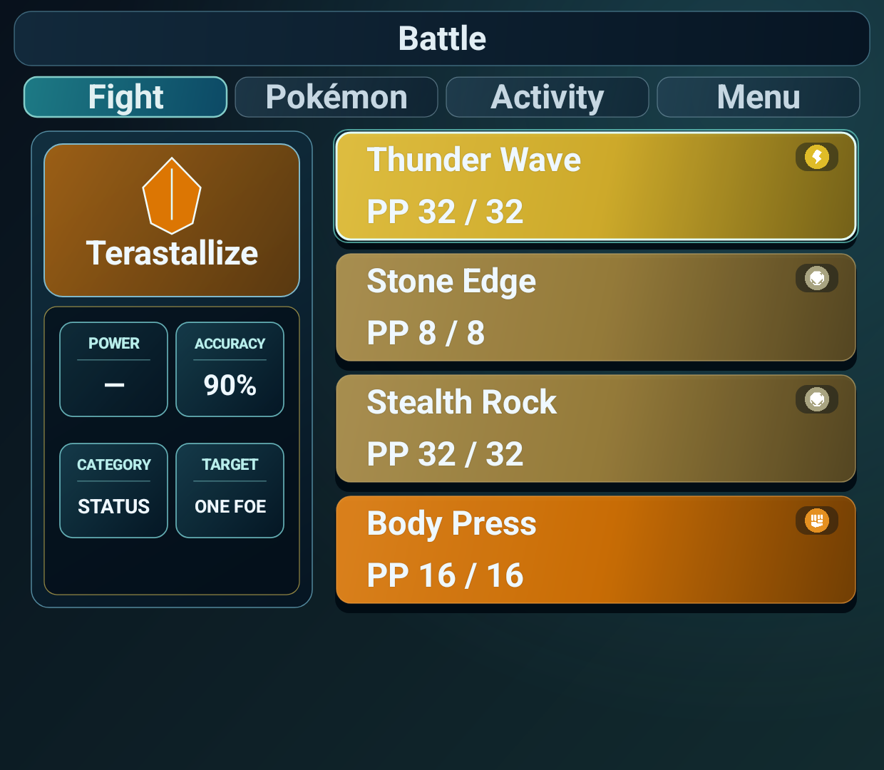
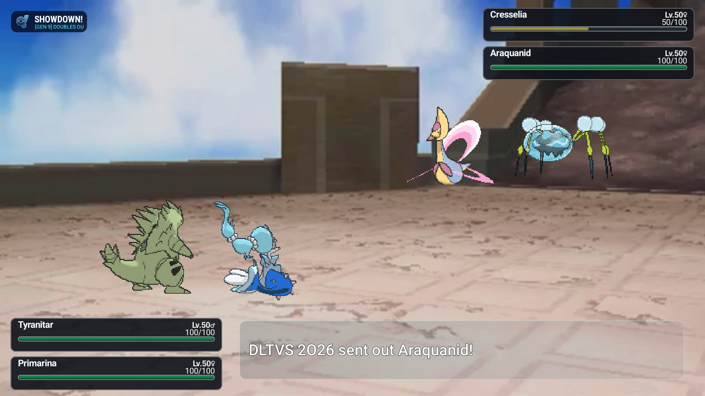
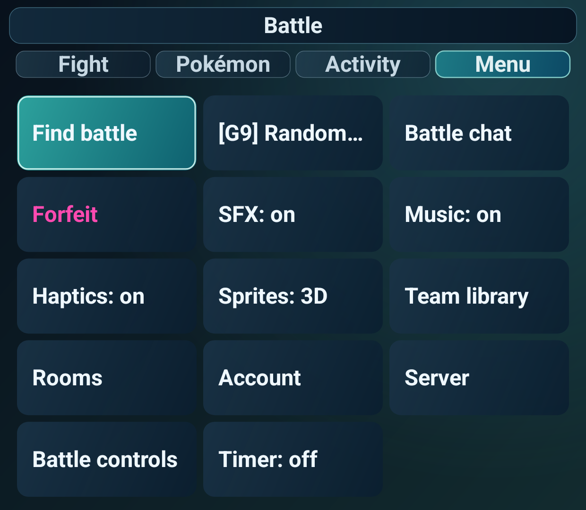

# Showdown!

Native Android Pokémon Showdown client for the AYN Thor dual-screen handheld.

<table>
  <tr>
    <td width="60%"></td>
    <td width="40%"></td>
  </tr>
  <tr>
    <td width="60%"></td>
    <td width="40%"></td>
  </tr>
</table>

## Hardware target

All physical measurements use metric units.

- Upper display: 1920 × 1080 pixels, 152.4 mm diagonal, 120 Hz.
- Lower display: 1240 × 1080 pixels, 99.6 mm diagonal, 60 Hz.
- Closed enclosure: 150 × 94 × 25.6 mm, approximately 380 g.

The repository AVD uses the two display resolutions and densities from the Thor target. The display sizes are listed by [AYN](https://www.ayntec.com/products/ayn-thor), with the resolution and enclosure dimensions cross-checked against [Android Central](https://www.androidcentral.com/gaming/android-games/ayn-thor-pre-orders-open-tonight-and-its-much-cheaper-than-i-thought).

## Build

```sh
./scripts/setup-android.sh
./scripts/create-ayn-thor-avd.sh
./scripts/run-ayn-thor-avd.sh
gradle assembleDebug
adb install -r app/build/outputs/apk/debug/app-debug.apk
```

Set `AYN_THOR_VSYNC_RATE=120` when validating the upper display at its target refresh rate.

## Support the project

If this client is useful to you, [sponsor the project on GitHub](https://github.com/sponsors/castdrian) or [support it on Ko-fi](https://ko-fi.com/castdrian).

## Releases

Use `vMAJOR.MINOR.PATCH-alpha.N`, `vMAJOR.MINOR.PATCH-beta.N`, or `vMAJOR.MINOR.PATCH` tags for prereleases and stable releases.

Release APKs use the `showdown-<tag>.apk` filename.
