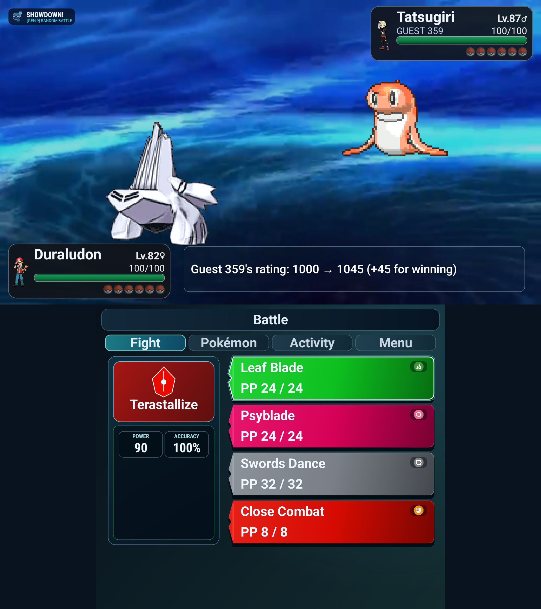
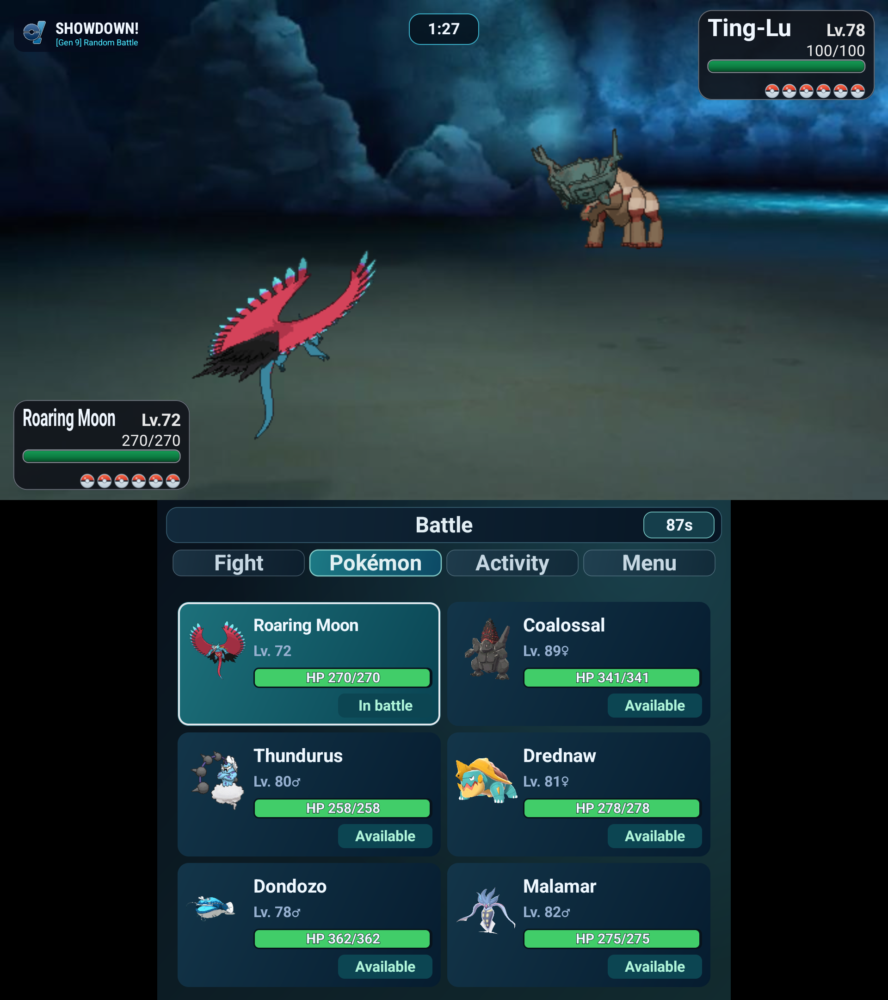

# Showdown!

Native Android Pokémon Showdown client for the AYN Thor dual-screen handheld.

<table>
  <tr>
    <td width="50%"></td>
    <td width="50%"></td>
  </tr>
</table>

Includes live Showdown battles, readable two-screen playback, HD-first battle and team-preview sprites with shiny front and rear variants, an optional Pokémon Battle Revolution announcer mode, searchable battle and team formats, searchable team selection, searchable replays, searchable rooms, tournaments, public ladders and player profiles, and a team library with four move slots per Pokémon, shared team-link imports, replays, rooms, chat, and account tools.

## Hardware target

All physical measurements use metric units.

- Upper display: 1920 × 1080 pixels, 152.4 mm diagonal, 120 Hz.
- Lower display: 1240 × 1080 pixels, 99.6 mm diagonal, 60 Hz.
- Closed enclosure: 150 × 94 × 25.6 mm, approximately 380 g.

The active panel areas are approximately 132.83 × 74.72 mm on top and 75.11 × 65.42 mm on the bottom, derived from the listed diagonals and native pixel aspect ratios.

The repository AVD uses the two display resolutions and densities from the Thor target. The display sizes are listed by [AYN](https://www.ayntec.com/products/ayn-thor), with the resolution and enclosure dimensions cross-checked against [Android Central](https://www.androidcentral.com/gaming/android-games/ayn-thor-pre-orders-open-tonight-and-its-much-cheaper-than-i-thought). Its host renderer uses the Vulkan emulator feature with automatic GPU selection; the APK itself is not split into graphics-backend builds.

## Build

```sh
./scripts/setup-android.sh
./scripts/create-ayn-thor-avd.sh
AEMU_SOURCE_ROOT=/path/to/aemu ./scripts/build-ayn-thor-emulator-overlay.sh
./scripts/run-ayn-thor-avd.sh
gradle assembleDebug
adb install -r app/build/outputs/apk/debug/app-debug.apk
```

The AYN Thor launcher requires the patched emulator overlay so the 1920 × 1080 upper display is rendered above the 1240 × 1080 lower display. It stops with an actionable message instead of silently using a stock compositor with the wrong physical order. Set `AYN_THOR_ALLOW_STOCK_EMULATOR=1` only when diagnosing the Android app without validating the Thor window layout.

The launcher defaults to a resource-safe low-RAM debug profile: 1 virtual CPU, 1024 MB of guest RAM, a 128 MB VM heap, a 30 Hz host frame cap, and host Vulkan on macOS. The low-RAM emulator flag prevents API 34 from silently inflating the guest allocation to its normal phone profile. The guest still renders at the Thor's native display sizes and calibrated densities; the host emulator window does not change those guest metrics. Set `AYN_THOR_VSYNC_RATE=120` when validating the upper display at its target refresh rate. If a larger debug profile or a different graphics backend is needed, set `AYN_THOR_CPU_CORES`, `AYN_THOR_RAM_MB`, `AYN_THOR_HEAP_MB`, or `AYN_THOR_GPU_MODE` explicitly.

On macOS, the launcher scales the host preview to the upper panel's physical width by default using the host display's reported millimetres. The compositor renders the lower panel at its real physical ratio while keeping its guest resolution at 1240 × 1080, and maps host touches back to that native resolution. Set `AYN_THOR_WINDOW_SCALE` to `auto` or a value between `0.1` and `1.0` to adjust the desktop preview without changing the guest display metrics.

The APK uses Android Canvas and WebView, so it does not have separate graphics-backend builds. The AVD launcher defaults to `AYN_THOR_GPU_MODE=auto`, which lets the emulator select the best available renderer. Use `AYN_THOR_GPU_MODE=host` to use the host GPU or `swiftshader` for software rendering.

## Support the project

If this client is useful to you, [sponsor the project on GitHub](https://github.com/sponsors/castdrian) or [support it on Ko-fi](https://ko-fi.com/castdrian).

## Releases

Use `vMAJOR.MINOR.PATCH-alpha.N`, `vMAJOR.MINOR.PATCH-beta.N`, or `vMAJOR.MINOR.PATCH` tags for prereleases and stable releases.

Release APKs use the `showdown-<tag>.apk` filename.
